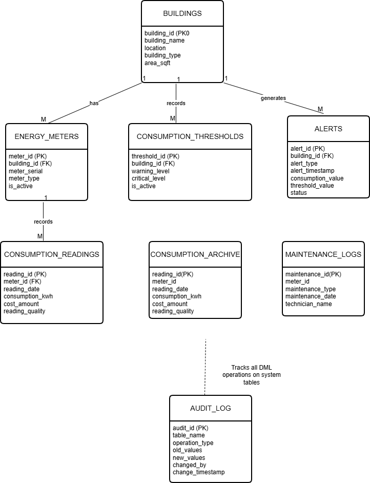

# Energy Management System - Capstone Project

## 📋 Project Overview
A comprehensive Oracle Database and PL/SQL solution for managing energy consumption, enforcing business rules, and providing business intelligence dashboards. This system helps organizations monitor energy usage, control costs, and ensure compliance with operational restrictions.

**Student Name:** MUNEZERO Cindy  
**Student ID:** 27120  
**Course:** PL/SQL Programming Capstone  
**Date:** December 2025

## 🎯 Problem Statement
Organizations face challenges in monitoring and controlling energy consumption across multiple buildings, leading to inefficient usage and high operational costs. The lack of automated business rule enforcement results in unauthorized data modifications during restricted periods, while missing audit trails make compliance monitoring difficult.

## 📊 Key Objectives
1. **Data Management:** Create normalized database schema for tracking energy consumption across 15+ buildings
2. **Business Rule Enforcement:** Automate DML restrictions on weekdays and public holidays
3. **Audit & Compliance:** Implement comprehensive logging with user tracking and clear error messages
4. **Business Intelligence:** Develop interactive dashboards for executive, audit, and performance monitoring
5. **Performance Analysis:** Track threshold violations and generate actionable insights

## 📸 Visual Documentation

### 🏆 Dashboard Overview

*Interactive BI dashboard with Executive, Audit, and Performance tabs*

### 🔐 Business Rule in Action

*Real-time enforcement: INSERT operation blocked on Monday with clear error message*

### 📋 Audit & Compliance

*Complete audit log showing user, operation, restriction reason, and timestamp*

### ⚡ Performance Analytics  

*Building ranking, consumption trends, and threshold violation heatmap*

### 🧪 Testing Verification

*Comprehensive test suite showing all requirements met*

### 🗄️ Database Schema

*Database architecture with 7 core tables and relationships*

## 🚀 Quick Start Instructions

### Prerequisites
- Oracle Database 11g or higher
- SQL Developer
- Web browser (Chrome/Firefox)
- Basic SQL/PL/SQL knowledge

### Installation Steps
1. **Clone/Download** the project files
2. **Run SQL scripts** in order (01-08 in database/ folder)
3. **Verify installation:**
   
### 🔗 Documentation Links
📋 **[Business Requirements](business_intelligence/bi_requirements.md)** - Stakeholder analysis and BI specs  
📊 **[Dashboard Designs](business_intelligence/dashboards.md)** - UI mockups and implementation  
📈 **[KPI Definitions](business_intelligence/kpi_definitions.md)** - Metrics and calculations  
🗄️ **[Data Dictionary](documentation/data_dictionary.md)** - Database schema reference  
🏗️ **[System Architecture](documentation/architecture.md)** - Technical architecture  
🤔 **[Design Decisions](documentation/design_decisions.md)** - Technical choices made

### Complete Test Results - Validation tests

🧪 Testing Summary
✅ Weekday DML: Blocked with clear error messages
✅ Holiday DML: Blocked with holiday-specific messages
✅ Weekend DML: Allowed (when not a holiday)
✅ Audit Logging: All attempts captured with user details
✅ Error Messages: Clear and informative
✅ User Tracking: Complete audit trail with OS/machine info

### 🛠️ Technologies
Database: Oracle 19c with PL/SQL

Frontend: HTML5, CSS3, JavaScript, Chart.js

Backend: PHP with OCI8 (optional)

Tools: SQL Developer, VS Code

### 📞 Support
For questions or issues:

Review the documentation files

Check test results in tests/comprehensive_testing.sql

Contact: cindyyymun55@gmail.com

Project Status: ✅ Complete - All requirements implemented and tested
Last Tested: December 2025
Academic Project - For Educational Purposes